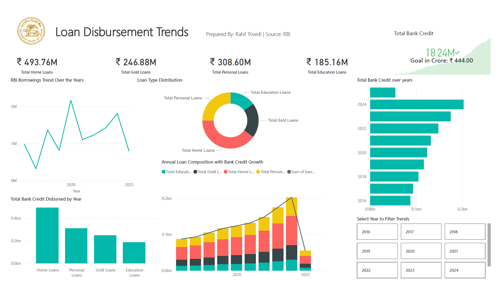

# 📊 Loan Disbursement & NPA Analysis Dashboard

A professional-grade dashboard project built using **Power BI**, **MySQL**, and **Excel** to analyze loan disbursement trends, loan types, and the emergence of NPAs (Non-Performing Assets) across time.

---

## 📌 Project Overview

This project simulates how a financial institution like a bank monitors and analyzes its loan distribution across multiple categories such as **Home Loans**, **Personal Loans**, **Gold Loans**, and **Education Loans**, while also keeping track of **NPAs**. The data pipeline involves:

- **Excel** for initial cleaning and manual transformations  
- **MySQL** to simulate a backend database with real SQL operations  
- **Power BI** for visual storytelling, KPI tracking, and dynamic dashboards  

---

## 🧰 Tools & Technologies Used

| Tool         | Purpose                        |
|--------------|--------------------------------|
| Microsoft Excel | Data cleaning & formatting     |
| MySQL Workbench | SQL queries & backend logic     |
| Power BI     | Data modeling & dashboarding   |
| Canva        | Presentation design            |
| GitHub       | Project documentation & hosting|

---

## 📁 Folder Structure

Loan Disbursement/
- │
- ├── data/
- - │ ├── loan_disbursement.csv
- - │ └── Scheduled_Commercial_Banks.xlsx
- │
- ├── dashboard/
- - │ └── Loan_Disbursement_Dashboard.pbix
- │
- ├── queries/
- - │ └── loan_disbursement_queries.sql
- │
- ├── report/
- --│ ├── Project_Report.pdf
- - │ └── Project_Presentation.pptx
- │
- ├── README.md

---

---

## 📊 Dashboard Highlights

- **KPI Cards** for total loans by type  
- **Trend charts** for RBI borrowings and NPAs  
- **Stacked & Clustered Column Charts** for loan types vs bank credit  
- **Line + Column Chart** for multi-trend analysis  
- **Region & Loan Type Filters** for interactivity  

>   

---

## 🔍 Use Case

> Useful for banks, financial analysts, and auditors to visualize loan disbursement performance and detect early signs of non-performing assets over time.

---

## 🧠 Key Learnings

- SQL backend creation and importing real datasets
- Power BI visual building blocks like DAX, KPIs, slicers
- Data storytelling and designing effective dashboards
- Using Excel for data transformation before BI ingestion
- Structuring and presenting a complete data analytics project

---

## ✅ How to Run This Project

1. Clone or download this repository  
2. Open `loan_disbursement.csv` to explore the data  
3. Open the `.pbix` file in Power BI Desktop  
4. Review the `loan_disbursement_queries.sql` in MySQL Workbench  
5. Use the report folder for detailed explanation & screenshots  

---

## 📢 Author

**Rahil Trivedi**  
*Aspiring Data Analyst | Power BI & SQL Enthusiast*  
📧 rahiltrivedi138@gmail.com 

---

## 📌 License

This project is intended for educational and showcase purposes.
